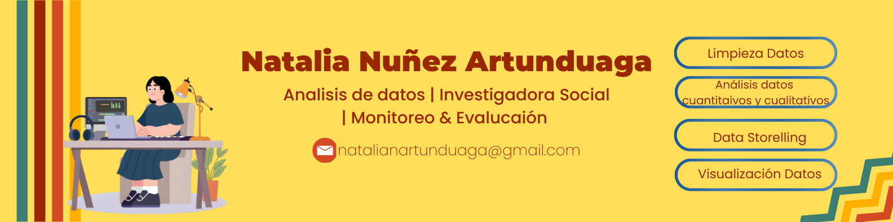

Soy analista de datos con experiencia en investigación social, monitoreo y evaluación de proyectos. Me interesa transformar información cuantitativa y cualitativa en visualizaciones, indicadores e insights que ayuden a comprender mejor los problemas sociales, comunitarios y educativos.

---

## Sobre mi enfoque

Me gusta trabajar con datos que no solo muestran números, sino también historias, patrones y oportunidades de mejora. Busco conectar el análisis técnico con el contexto social para generar evidencia útil en la toma de decisiones y en la evaluación de impacto de programas y proyectos.

---

## Habilidades e intereses

🌱 Análisis de datos aplicado a problemas sociales, comunitarios y educativos.

📊 Construcción de dashboards, indicadores y visualizaciones para comunicar hallazgos de forma clara.

🔎 Investigación social con métodos mixtos: encuestas, entrevistas, análisis documental y sistematización de información.

📌 Monitoreo y evaluación de proyectos, seguimiento de indicadores e informes técnicos.

💡 Interpretación de datos para generar recomendaciones, identificar patrones y apoyar la toma de decisiones.

---
Actualmente me interesa

Seguir fortaleciendo proyectos donde el análisis de datos permita comprender realidades sociales, evaluar procesos y comunicar resultados de forma clara, visual y accionable.

---

## Contacto

---

## Herramientas

---

## Competencias analíticas

- Limpieza, transformación y análisis exploratorio de datos.
- Construcción de KPIs, indicadores y dashboards.
- Visualización de datos y data storytelling.
- Análisis cualitativo y cuantitativo.
- Diseño y análisis de encuestas, entrevistas y fuentes documentales.
- Monitoreo y evaluación de proyectos sociales, comunitarios y educativos.
- Sistematización de información y elaboración de informes técnicos.
- Generación de hallazgos y recomendaciones para la toma de decisiones.

---

## Proyectos destacados

### RappiPlus: De datos a decisiones de negocio

Análisis de ventas, marketing, comportamiento de usuarios y testing A/B para evaluar el desempeño de un servicio de suscripción.

- Analicé ventas, canales de adquisición, cohortes y retención de usuarios.
- Identifiqué fricciones entre Add to Cart y Add Payment Info dentro del funnel de conversión.
- Construí un dashboard en Power BI con KPIs de ventas, marketing y desempeño del negocio.
- Propuse acciones orientadas a optimizar el checkout, mejorar la experiencia del usuario y fortalecer la retención.

[Ver proyecto](LINK_DEL_REPOSITORIO)

---

### Movilidad urbana y productividad económica en ciudades de LATAM

Análisis de congestión, retrasos, contaminación y variables socioeconómicas en ciudades latinoamericanas para comprender patrones de movilidad y presión urbana.

- Analicé indicadores de movilidad urbana en ciudades como Bogotá, Ciudad de México, São Paulo y Lima.
- Identifiqué ciudades con niveles críticos de congestión, retrasos y contaminación.
- Relacioné patrones de movilidad con productividad económica, bienestar social y calidad de vida urbana.
- Construí visualizaciones para comunicar hallazgos de forma clara y facilitar la comparación entre ciudades.

[Ver proyecto](LINK_DEL_REPOSITORIO)
